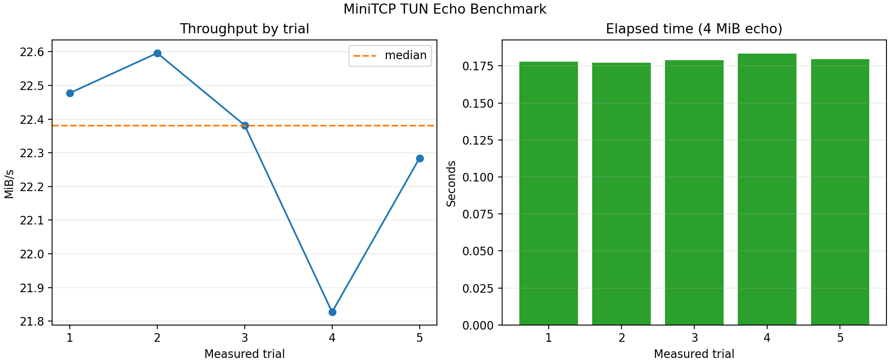

# MiniTCP — A User-Space TCP/IP Stack

[](https://www.rust-lang.org/)
[](https://doc.rust-lang.org/cargo/)
[](https://www.docker.com/)
[](https://www.kernel.org/)
[](#test-results)
[](#benchmark-gcp-tun-echo)
[](LICENSE)

> A TCP/IP stack written in Rust that processes raw IP packets over a Linux TUN
> interface. It implements IPv4, ICMP, UDP, and an eleven-state TCP machine
> with retransmission, flow control, and out-of-order reassembly—and is
> exercised by unmodified `ping`, `curl`, and `netcat` clients.

## Portfolio snapshot

| Area | Evidence |
|---|---|
| **Protocol work** | IPv4 parsing/checksums, ICMP echo, UDP, and TCP from raw packet bytes upward |
| **TCP reliability** | Handshake, all eleven RFC states, receive-window flow control, retransmission/backoff, reassembly, and teardown |
| **Application boundary** | Socket-like TCP/UDP API with observable receive-timeout and buffer options |
| **Validation** | 11 automated tests, lossy in-process link simulation, and real Linux interoperability checks |
| **Measured performance** | 22.38 MiB/s median application-payload throughput on a GCP `e2-standard-2` TUN echo benchmark |

---

## Why this project

MiniTCP moves the boundary normally hidden inside the kernel into a compact,
inspectable Rust codebase. Linux provides a TUN interface that exchanges raw IP
packets; MiniTCP owns everything above it: header parsing and checksums, packet
dispatch, connection lifecycle, retransmission, buffering, and the
application-facing socket API.

That makes each familiar network operation concrete. A `curl` connection
becomes a SYN on the TUN device, then explicit state transitions and generated
segments. The implementation remains small enough to follow end to end while
still interoperating with the host's real networking tools and a second
MiniTCP instance across kernel IP forwarding.

---

## Repo Structure

```
minitcp/
├── README.md
├── Cargo.toml
├── docker/
│   └── Dockerfile           ← Linux dev/runtime environment (TUN needs real Linux)
├── docker-compose.yml
├── src/
│   ├── lib.rs               ← crate root: module declarations, re-exports
│   ├── tun.rs               ← open/configure the TUN device (libc ioctl, the one real `unsafe`)
│   ├── ip.rs                ← header parse/construct, checksum
│   ├── icmp.rs              ← echo request/reply
│   ├── udp.rs               ← UdpTable: bind registry + per-binding receive queues
│   ├── tcp.rs               ← the core: state machine + reliability (TcpTable)
│   ├── stack.rs             ← Stack: owns all protocol state, the socket API
│   └── bin/
│       ├── minitcp.rs       ← bare protocol demo: ICMP echo + UDP auto-echo
│       ├── chat_server.rs   ← demo app: chat + HTTP, built on the socket API
│       ├── chat_client.rs
│       └── bench_echo_server.rs ← quiet TCP echo peer for repeatable measurements
├── tests/
│   ├── retransmission.rs    ← simulate packet loss, verify retry + backoff
│   └── sockopt.rs           ← setsockopt/getsockopt, SO_RCVTIMEO actually timing out
├── bench/                    ← GCP runner, raw results, and matplotlib plot
├── scripts/
│   ├── setup_tun.sh         ← create tun0/tun1 with point-to-point addressing
│   └── teardown_tun.sh
└── docs/
    ├── protocol_notes.md    ← header layouts, byte offsets, checksum algorithm
    └── state_machine.md     ← annotated FSM, RFC sections, scope cuts
```

Unit tests for `checksum16`, the TCP state machine, and the UDP socket layer
live as `#[cfg(test)] mod tests` blocks inside `ip.rs`/`tcp.rs`/`udp.rs`
respectively — `cargo test` discovers these automatically alongside the two
integration tests above, with no separate test-registration step (unlike
CTest's `add_test`).

---

## What MiniTCP Implements

**IP layer** — `src/ip.rs`
Parses and constructs IPv4 headers: version, header length, total length,
TTL, protocol field, header checksum, source and destination addresses.
Validates the header checksum on receipt and recomputes it on send.

**ICMP** — `src/icmp.rs`
Responds to ICMP Echo Request (type 8) with Echo Reply (type 0), so the
real `ping` command run against MiniTCP's virtual IP address gets a correct
reply.

**UDP** — `src/udp.rs`
Parses and constructs UDP headers (source port, destination port, length,
checksum, including the 12-byte pseudo-header). A datagram is delivered to
an application socket if one is bound to its destination `(address, port)`;
otherwise it's echoed back to the sender, exactly as before the socket-level
UDP API existed.

**TCP** — `src/tcp.rs` (the centerpiece)

- The three-way handshake: `SYN` → `SYN-ACK` → `ACK`
- The full eleven-state connection state machine (RFC 793 / RFC 9293),
  including the simultaneous-close edge case — see
  [docs/state_machine.md](docs/state_machine.md)
- Sliding-window flow control using the receive window field
- Per-segment retransmission with exponential backoff (RFC 6298-style,
  single timer per connection)
- In-order delivery: out-of-order segments are buffered and spliced in once
  gaps are filled
- Graceful connection teardown in both directions: local-initiated close
  and remote-initiated close are genuinely different code paths, both
  tested against real `nc`
- `TIME_WAIT` correctly re-ACKs a retransmitted FIN (the scenario
  `TIME_WAIT` exists to handle) rather than silently dropping it

Slow-start congestion control was scoped out — see
[docs/state_machine.md](docs/state_machine.md#why-no-real-congestion-control)
for why.

**Socket-like API** — `src/stack.rs`
A `Stack` type that owns every piece of protocol state (the TCP connection
table, the UDP bind table, the TUN fd) and an application-facing API so
application code looks like BSD sockets and never touches `TcpConnection`/
`TcpState`/`UdpBinding` directly — just an opaque, `Copy`-able `SocketId`:

- TCP: `Stack::socket`, `listen`, `accept`, `connect`, `send`, `recv`,
  `close`. Used by both demo apps below.
- UDP: `Stack::udp_socket`, `bind`, `sendto`, `recvfrom`, using idiomatic
  `std::net::SocketAddrV4` values.
- Socket options: a typed `SockOpt` enum for receive timeouts, address reuse,
  and receive/send buffer caps. Each option changes behavior, rather than
  merely being stored as metadata.

**Demo apps** — `src/bin/chat_server.rs`, `src/bin/chat_client.rs`
A minimal chat server/client built only on the socket API. The server also
recognizes HTTP requests and answers with a fixed `200 OK`, so the same
listener serves both `nc` chat sessions and `curl`.

---

## TCP State Machine

This is the core TCP lifecycle implemented by MiniTCP. See
[docs/state_machine.md](docs/state_machine.md) for an annotated version with
the RFC section and implementing function for every transition.

```
                         CLOSE                    CLOSE
                  ┌────────────────┐       ┌───────────────────┐
                  ▼                │       ▼                   │
            ┌──────────┐           │ ┌──────────┐              │
            │  CLOSED  │           │ │  CLOSED  │              │
            └────┬─────┘           │ └────┬─────┘              │
                 │ LISTEN          │      │ active OPEN        │
                 ▼                 │      │ (send SYN)         │
            ┌──────────┐           │      ▼                    │
            │  LISTEN  │           │ ┌──────────┐              │
            └────┬─────┘           │ │ SYN_SENT │              │
                 │ recv SYN        │ └────┬─────┘              │
                 │ (send SYN,ACK)  │      │ recv SYN,ACK       │
                 ▼                 │      │ (send ACK)         │
            ┌──────────┐           │      ▼                    │
            │ SYN_RCVD │           │ ┌─────────────┐           │
            └────┬─────┘           │ │ ESTABLISHED │◀──────────┘
                 │ recv ACK        │ └──────┬──────┘
                 └─────────────────┴────────┤
                                   data transfer
                                             │ close() (send FIN)
                                             ▼
                                      ┌─────────────┐
                                      │ FIN_WAIT_1  │
                                      └──────┬──────┘
                              recv ACK       │       recv FIN+ACK
                          ┌──────────────────┴──────────────────┐
                          ▼                                     ▼
                  ┌─────────────┐                       ┌─────────────┐
                  │ FIN_WAIT_2  │                       │   CLOSING   │
                  └──────┬──────┘                       └───────┬─────┘
                         │ recv FIN (send ACK)                  │ recv ACK
                         ▼                                      │
                  ┌─────────────┐                               │
                  │  TIME_WAIT  │◀──────────────────────────────┘
                  └──────┬──────┘
                         │ 2×MSL timeout
                         ▼
                  ┌──────────┐
                  │  CLOSED  │
                  └──────────┘
```

---

## Architecture

```
                         Application
          chat client/server or a manual test harness
                              │
                              ▼
                        Socket-like API
       TCP: connect/listen/accept/send/recv
       UDP: bind/sendto/recvfrom + typed socket options
                              │
                              ▼
                             TCP
       state machine, sliding window, reassembly, retransmission
                              │
                              ▼
                          UDP / ICMP
       UDP binding/auto-echo                         ICMP echo reply
                              │
                              ▼
                              IP
       IPv4 header parse/build, checksum, route decision
                              │
                              ▼
                         TUN device
       `/dev/net/tun` exchanges raw IP packets with the kernel
                              │
                              ▼
                 Linux routing and real network tools
                 `ping`, `curl`, and `netcat`
```

The TUN device is the key piece of infrastructure that makes this project
both tractable and demonstrable. The kernel handles Ethernet framing and
physical transmission; MiniTCP only ever sees and produces IP packets,
which keeps the scope focused on the protocols that matter, while still
producing a stack that real, unmodified tools can talk to.

Development happens on macOS via Docker (a Linux container, since TUN/TAP
needs a real Linux kernel); the same `Dockerfile`/`docker-compose.yml` work
unmodified on a native Linux host.

---

## Benchmark: GCP TUN echo



MiniTCP reached a **22.38 MiB/s median** application-payload throughput on a
Google Compute Engine `e2-standard-2` VM (two vCPUs), with five measured 4 MiB
echo transfers after one warm-up. Samples ranged from **21.83 to 22.60 MiB/s**;
the fourth trial is the slowest, but the plot shows a tight overall band and no
runaway variance.

This measures a kernel TCP client sending data through `tun0` to the quiet
`bench_echo_server`, which echoes it through MiniTCP. It is intentionally a
single-client, same-VM end-to-end TUN measurement: it validates the stack's
data path without claiming Internet throughput or multi-connection
scalability. The figure is retained as portfolio documentation; raw benchmark
output is machine-specific and intentionally ignored by Git.

To reproduce on a Linux VM with `/dev/net/tun` and passwordless `sudo`:

```bash
./bench/run_gcp_vm.sh
```

The runner installs its dependencies, builds the release binary, captures JSON
and host metadata, renders the matplotlib plot, and removes `tun0` on exit.

---

## Example Session — Real Trace, Not a Mockup

Captured live: `chat_server --trace` running on `tun0` (self address
`10.0.0.2`), a real `nc 10.0.0.2 8080` from a second shell in the same
container.

```
chat_server: listening on port 8080 (self=10.0.0.2, tun=tun0)
[IP  ] recv  10.0.0.1 -> 10.0.0.2   proto=TCP  len=60
[TCP ] recv  SYN         seq=1842910416 ack=0 win=64240 len=20  state=LISTEN
[TCP ] state LISTEN -> SYN_RCVD
[TCP ] send  SYN,ACK     seq=531850564 ack=1842910417 win=65535 len=0
[IP  ] recv  10.0.0.1 -> 10.0.0.2   proto=TCP  len=40
[TCP ] recv  ACK         seq=1842910417 ack=531850565 win=64240 len=0  state=SYN_RCVD
[TCP ] state SYN_RCVD -> ESTABLISHED
chat_server: client connected

--- connection established, application can now send/recv ---

[IP  ] recv  10.0.0.1 -> 10.0.0.2   proto=TCP  len=46
[TCP ] recv  ACK,PSH     seq=1842910417 ack=531850565 win=64240 len=6  state=ESTABLISHED
[TCP ] send  ACK         seq=531850565 ack=1842910423 win=65530 len=0
hello
[TCP ] send  ACK,PSH     seq=531850565 ack=1842910423 win=65535 len=6

[IP  ] recv  10.0.0.1 -> 10.0.0.2   proto=TCP  len=40
[TCP ] recv  ACK,FIN     seq=1842910423 ack=531850571 win=64234 len=0  state=ESTABLISHED
[TCP ] send  ACK         seq=531850571 ack=1842910424 win=65535 len=0
[TCP ] state ESTABLISHED -> CLOSE_WAIT
chat_server: client disconnected
[TCP ] send  ACK,FIN     seq=531850571 ack=1842910424 win=65535 len=0
[TCP ] state CLOSE_WAIT -> LAST_ACK
[IP  ] recv  10.0.0.1 -> 10.0.0.2   proto=TCP  len=40
[TCP ] recv  ACK         seq=1842910424 ack=531850572 win=64234 len=0  state=LAST_ACK
[TCP ] state LAST_ACK -> CLOSED
```

`curl` against the same listener, proving the stack is indistinguishable
from a real one to a completely unmodified HTTP client:

```
$ curl -s -i http://10.0.0.2:8080/
HTTP/1.1 200 OK
Content-Length: 6
Connection: close

hello
```

---

## Test Results

Eight unit tests (in-crate `#[cfg(test)]` modules) plus three integration
tests (in `tests/`, run as separate crates against the public API), all run
via `cargo test`:

```
running 8 tests
test ip::tests::known_vector ... ok
test ip::tests::odd_length ... ok
test ip::tests::build_then_verify_round_trip ... ok
test udp::tests::echo_fallback_when_unbound ... ok
test udp::tests::sendto_recvfrom_round_trip ... ok
test udp::tests::recv_queue_cap_drops_oversized_datagram ... ok
test udp::tests::so_reuseaddr_listen_guard ... ok
test tcp::tests::full_lifecycle_handshake_ooo_and_close ... ok

test result: ok. 8 passed; 0 failed; 0 ignored; 0 measured; 0 filtered out

     Running tests/retransmission.rs
test retransmission_under_packet_loss ... ok

     Running tests/sockopt.rs
test getsockopt_round_trip ... ok
test so_rcvtimeo_actually_times_out ... ok
```

- **`ip::tests`** — the RFC 1071 worked example, a build/verify
  round-trip, and an odd-length edge case.
- **`tcp::tests::full_lifecycle_handshake_ooo_and_close`** — drives
  `TcpTable::handle_segment()` directly with hand-crafted segments (no TUN
  device): three data segments delivered **out of order** (`C, A, B`) are
  reassembled correctly before being handed to the application, then the
  connection is torn down via remote-FIN → local `close()`.
- **`tests/retransmission.rs`** — two in-process TCP endpoints connected
  over a lossy simulated link (a real packet-loss harness, not a mock), run
  at 0%, 10%, and 30% simulated loss in a single test:

  ```
  retransmission_test: drop_rate=  0%  completed OK  (simulated drops: 0, data: "hello from minitcp client")
  retransmission_test: drop_rate= 10%  completed OK  (simulated drops: 1, data: "hello from minitcp client")
  retransmission_test: drop_rate= 30%  completed OK  (simulated drops: 2, data: "hello from minitcp client")
  ```

  Every trial completes the full handshake → data transfer → simultaneous
  teardown sequence correctly regardless of loss rate — just with more
  retransmissions logged at higher loss.

- **`udp::tests`** — drives `UdpTable`/`TcpTable` directly (no TUN device):
  a `sendto`/`recvfrom`-style round trip through a bound `UdpBinding`, a
  datagram dropped when it would exceed the `SO_RCVBUF` cap, the auto-echo
  fallback still firing when nothing is bound to a port, and the
  `SO_REUSEADDR` guard in `TcpTable::listen` — blocked by a connection
  sitting in `TIME_WAIT`, then allowed through once `reuse_addr` is set.
- **`tests/sockopt.rs`** — exercises `Stack::setsockopt`/`get_*` end to end
  against a real (in-process) blocking call, using `Stack::init_with_fd()`
  with a `socketpair` standing in for the TUN device: `SockOpt::RcvTimeo`
  actually causes an idle `Stack::recvfrom()` to return `minitcp::TIMEOUT`
  instead of blocking forever, and `SockOpt::ReuseAddr`/`RcvBuf`/`SndBuf`
  round-trip correctly through the `get_*` accessors.

**Manually verified against real, unmodified tools** (see
[Build & Run](#build--run) for the exact commands):

| Scenario | Tool | Result |
|---|---|---|
| ICMP echo | `ping -c 4 10.0.0.2` | 4/4 replies, correct trace |
| UDP echo | `nc -u 10.0.0.2 9000` | line echoed back |
| TCP handshake + chat, remote-initiated close | `nc 10.0.0.2 8080` | `SYN→SYN,ACK→ACK→ESTABLISHED`, data echoed, clean `FIN→CLOSE_WAIT→LAST_ACK→CLOSED` |
| TCP + HTTP, local-initiated close | `curl http://10.0.0.2:8080/` | correct `200 OK`, clean `FIN_WAIT_1→FIN_WAIT_2→TIME_WAIT→CLOSED` |
| MiniTCP talking to MiniTCP | `chat_client` ↔ `chat_server` on separate TUN devices, bridged by real kernel IP forwarding | full two-party conversation over our own TCP implementation on both ends |
| UDP socket API | a small program using `Stack::udp_socket`/`bind`/`recvfrom`/`sendto`, exercised with `nc -u 10.0.0.2 <port>` | bound port: trace shows `deliver -> bound app socket`, the app echoes the datagram; a *different*, unbound port still auto-echoes as before |
| `SO_RCVTIMEO` | the same program, left idle with a 1s receive timeout set | `Stack::recvfrom` returns `minitcp::TIMEOUT` once a second instead of blocking forever |

---

## Build & Run

MiniTCP needs a real Linux TUN device, so on macOS (or any non-Linux host)
development happens inside a Docker container. On native Linux, skip the
Docker steps and just run the `cargo` + script commands directly.

```bash
# Build the dev image and start the container (repo is bind-mounted)
docker compose up -d
docker compose exec minitcp bash      # "Shell A", inside the container from here on

# Build
cargo build --release

# Run the unit + integration tests (no TUN device needed — segments are
# crafted in-memory, and the socketpair-based tests stand in for a TUN fd)
cargo test

# Create tun0 (point-to-point: 10.0.0.1 is the kernel side, 10.0.0.2 is
# MiniTCP's own address — see the note below on why this matters)
sudo ./scripts/setup_tun.sh

# Run the chat/HTTP demo server
sudo ./target/release/chat_server --trace --port 8080
```

In a **second** `docker exec -it minitcp-dev bash` (a real second terminal
into the *same* container — see note below), exercise it with real tools:

```bash
ping -c 4 10.0.0.2                      # ICMP path
nc -u 10.0.0.2 9000                     # UDP echo
nc 10.0.0.2 8080                        # TCP chat — type lines, see them echoed
curl http://10.0.0.2:8080/              # TCP + the toy HTTP response
```

To watch MiniTCP talk to a *second instance of itself* across two TUN
devices bridged by the real kernel routing table:

```bash
# Still in Shell A / a third exec'd shell:
cat /proc/sys/net/ipv4/ip_forward       # must be 1; if not: sudo sysctl -w net.ipv4.ip_forward=1
sudo ip tuntap add dev tun1 mode tun
sudo ip addr add 10.0.1.1 peer 10.0.1.2 dev tun1
sudo ip link set tun1 up

./target/release/chat_client --tun tun1 --addr 10.0.1.2 --server 10.0.0.2 --port 8080
```

Tear down when done:

```bash
sudo ./scripts/teardown_tun.sh
```

### Why point-to-point addressing?

`setup_tun.sh` assigns `10.0.0.1` to the kernel side of `tun0` and
`10.0.0.2` as its **peer** address, then everything above (`ping`, `nc`,
`curl`, `chat_client`) targets `10.0.0.2` — never `10.0.0.1`. A plain
same-subnet address (`10.0.0.1/24`) doesn't work for testing *inside a
single container*: both the test client and MiniTCP would share one network
namespace, so the kernel would recognize `10.0.0.1` as already locally
owned and answer pings itself via loopback delivery, without the packet
ever reaching MiniTCP's `tun::tun_read()`. Point-to-point addressing forces
traffic to the peer address to actually route out through `tun0`, into
MiniTCP's own code.

---

## Implementation Notes

MiniTCP handles TCP reliability with a deliberately simple retransmission
model: each connection tracks unacknowledged segments and uses a single
per-connection retransmission timer with exponential backoff. This keeps the
mechanism compact while still exercising the core behavior required for data
delivery over a lossy link.

Out-of-order data is buffered until the missing sequence range arrives, then
spliced back into the receive stream before being exposed through
`Stack::recv`. `tcp::tests::full_lifecycle_handshake_ooo_and_close` covers
this by delivering three data segments in the order `C, A, B` and verifying
that the application receives the original byte stream.

Connection teardown is implemented as separate local-close and remote-close
paths. `TIME_WAIT` also re-ACKs retransmitted FINs, which is necessary when
the final ACK is lost and the peer retries its FIN.

Selective acknowledgment (`SACK`) and full congestion control are natural
future extensions. The current implementation focuses on correctness of the
core connection lifecycle, retransmission, in-order delivery, and
interoperability with real Linux networking tools.

UDP's socket layer and the socket options don't change any existing call
site's behavior. `UdpTable::handle_datagram()` only stops auto-echoing a
port once an application explicitly binds to it; nothing else observes the
difference. Socket options are genuinely wired up rather than just stored:
`SockOpt::RcvTimeo` bounds the same `pump_once()`-driven blocking loops that
`Stack::recv`/`accept` always used, `SockOpt::ReuseAddr` bypasses a real
"address in use" check in `TcpTable::listen()` for a port held by a
connection in `TIME_WAIT`, and `SockOpt::RcvBuf`/`SndBuf` resize the buffer
caps that default to fixed constants on `TcpConnection`/`UdpBinding`.
Because a fresh socket never touches these options, every existing demo app
and test keeps its original behavior by default.

**On the migration from the original C++ implementation**: there is no
global mutable state anywhere in this crate (the C++ version's
`g_connections`/`g_listeners`/`g_udp_binds` file-level globals). A single
`Stack` struct (`src/stack.rs`) owns the TCP connection table, the UDP bind
table, and the TUN fd, threaded through as `&mut self`. Every place the C++
version used a `shared_ptr<TCPConnection>`/`shared_ptr<UDPSocket>` to let
multiple owners (the connection table, an accept queue, the application's
`Socket`) alias the same object, this version instead uses a plain `Copy`
key (`ConnectionKey`, or a `(u32, u16)` bind key) into a `HashMap` that is
the *sole* owner of the data — no `Rc<RefCell<_>>` needed. Header
(de)serialization uses explicit big-endian byte-slice parsing
(`u16::from_be_bytes`/`to_be_bytes`) rather than packed structs and pointer
casts, so the only `unsafe` in the whole crate is the TUN device's
`ioctl(TUNSETIFF)` call in `src/tun.rs` and the `poll(2)` call in
`src/stack.rs`.

---

## Further Reading

- [docs/protocol_notes.md](docs/protocol_notes.md) — header layouts, byte
  offsets, the checksum algorithm with a worked example, and known
  limitations
- [docs/state_machine.md](docs/state_machine.md) — every transition mapped
  to its RFC section and implementing code, plus the simultaneous-open/close
  discussion
- [RFC 9293 — Transmission Control Protocol (TCP)](https://www.rfc-editor.org/rfc/rfc9293) —
  the current standard; supersedes the original RFC 793
- [RFC 791 — Internet Protocol](https://www.rfc-editor.org/rfc/rfc791)
- [Beej's Guide to Network Programming](https://beej.us/guide/bgnet/) —
  the standard reference for raw sockets and TUN/TAP setup
- *TCP/IP Illustrated, Volume 1* — W. Richard Stevens — the canonical text;
  Chapters 17–24 cover the TCP state machine and reliability mechanisms in
  the depth this project implements
- [level-ip](https://github.com/saminiir/level-ip) — a similar open-source
  user-space TCP/IP stack; useful as a reference implementation to compare
  design decisions against, not to copy from directly
